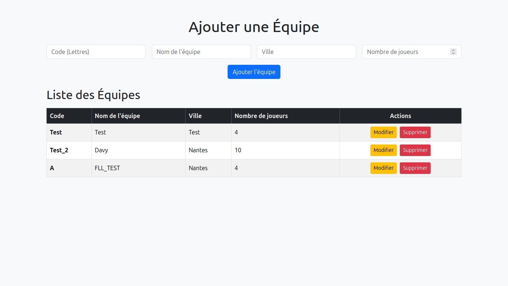
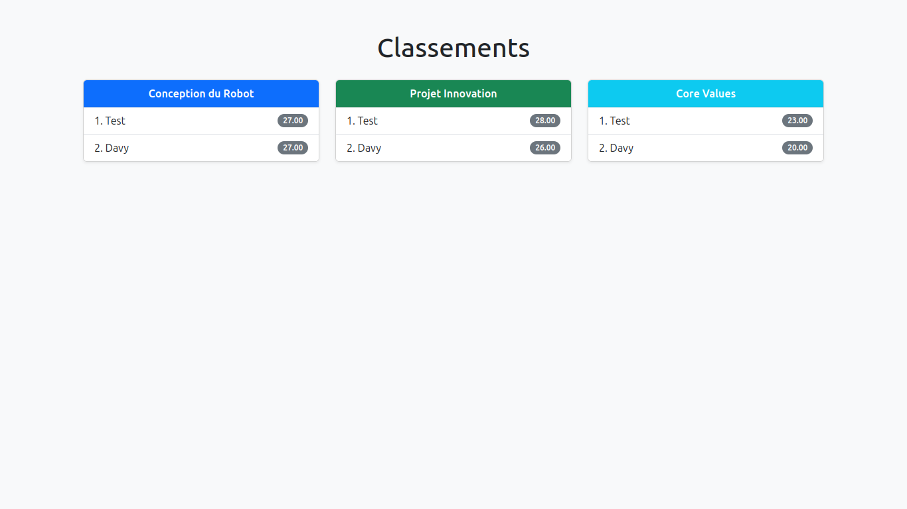

```markdown
# Présentation des images du dossier `Image_APP`

Voici la liste des images présentes dans le dossier `Image_APP` :

<!-- Remplacez les noms des fichiers par ceux présents dans votre dossier -->






<!-- Ajoutez ou modifiez les lignes ci-dessus selon les fichiers réels -->
```